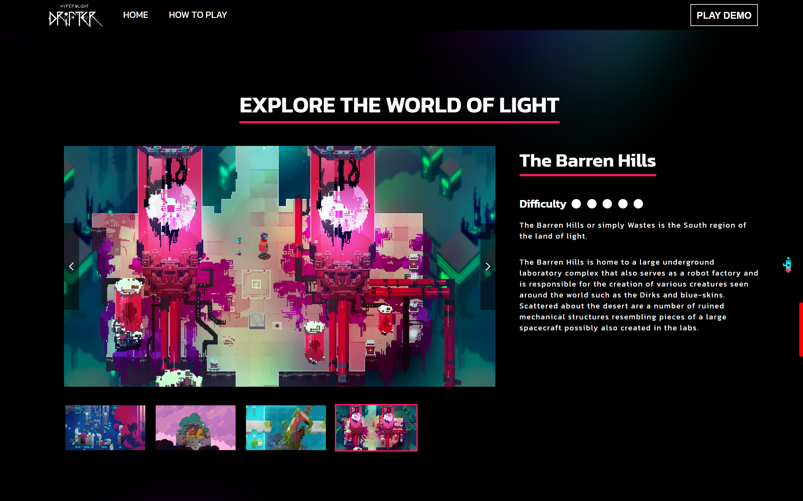
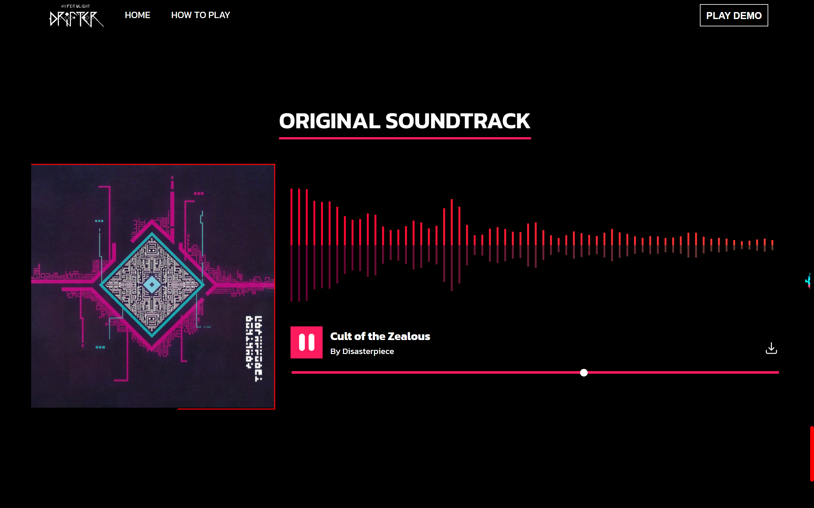
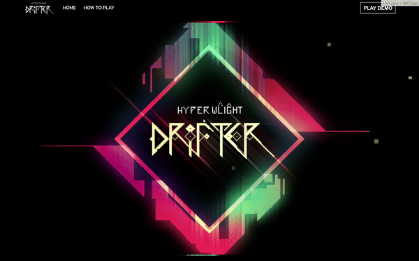

# Hyper WLight Drifter
A self-remake of the indie game Hyper Light Drifter in web form using HTML, TypeScript, and SCSS. This project uses the original game's assets to create a similar game and mechanics.

## Website
The deployed version of the website can be previewed [here](https://robert-wl.github.io/HyperWLightDrifter).

## Built With
This project is built using HTML, Typescript with JQuery, dan SCSS. A Typescript compiler is used to compile typescript codes into javascript code. SCSS compiler is also used to compile SCSS codes into CSS. 

## Contents
The first page of the website advertises the game and includes elements such as:
- An audio player with the game's soundtrack.
- GIFs advertising the game.
- Videos promoting the game.
- And more!

In the game itself, several new elements have been added or remade, including:
- A coin-based system based on the original game's modules system.
- An infinite map with randomly generated structures.
- Cheat codes.
- And more!

